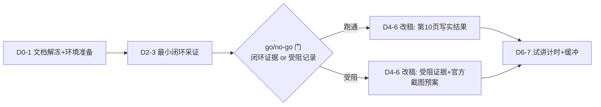

## 确认参数

- 路径 B：恢复 SITL 实验，解冻一小时门槛。
- 截止日 260929（原 260922，+7 天）；今天为第 0 天。
- 依据：epic「仿真保底」定位 + issue 004 要求"能跑/不能跑 + 用哪个仿真器 + 怎么录"的确定结论（现仍 open）；`03-simulation-assessment.md` 末尾"重新评估条件"正好被满足。

## 边界澄清（一处放宽）

原冻结边界"不联网、不安装系统包"是为一小时门控服务的。恢复 SITL 必须放宽：**环境搭建允许联网**（`git submodule update`、apt 装 cmake/ninja/java、或 `docker pull px4io/px4-dev-simulation-focal`）。**PPT 内容边界不变**：所有事实仍只用本地 `references/` 官方文档/源码与本次本机实测，不联网补素材。

## 排期（7 天，倒排检查点）

- **检查点1（D1 末）**：环境可起仿真或明确卡在哪。
- **检查点2（D3 末）**：go/no-go——闭环证据到手，或止损记录受阻点。
- **检查点3（D6 末）**：14 页大纲改稿 + 引用核对完成。
- **检查点4（D7）**：试讲计时校验（issue 006 验证项），留一天缓冲。

## 阶段一：环境准备（D0–D1，对应 issue 004）

沿用 `03` 已查明事实（WSL2 + Ubuntu 20.04.6、focal；缺 cmake/ninja/java/gazebo；子模块全未初始化），不重复预检。

1. **版本线**：在 `references/PX4-Autopilot` 用 git worktree 检出 v1.13.3 到独立目录跑 SITL（不动当前 v1.18 checkout，且贴合 PPT 的 v1.13 叙事）。
2. **子模块**：在该 worktree `git submodule update --init` 仿真所需项（MAVLink、sitl_gazebo / jMAVSim）；子模块 URL 为 github 绝对地址，必要时按 notes/003 走 ghfast.top 镜像。
3. **依赖（首选 WSL 原生）**：v1.13.3 自带 `Tools/setup/ubuntu.sh` 会装齐 cmake/ninja/java/ant/gazebo11（focal 对应 Gazebo Classic 11）。
4. **备选 Docker**：若原生受阻，在 WSL 内跑 `px4io/px4-dev-simulation-focal`（README 已列，正好配 focal），`Tools/docker_run.sh` 挂载源码；显示走 WSLg（`DISPLAY=:0` 已确认存在）。
5. **仿真器选择**：先试 `make px4_sitl gazebo`（Gazebo Classic 11，v1.13 标配）；受阻则 `make px4_sitl jmavsim`（需 java/ant）。
6. **QGC 连通**：两条候选——(a) Windows 已装 QGC（`U:\expro\QGroundControl\bin\QGroundControl.exe`）经 UDP 连 WSL IP，注意 WSL2 NAT 不通广播，需在启动参数指定地面站地址；(b) WSL 内跑 QGC AppImage 走 WSLg。以先通者为准，记录命令。

## 阶段二：go/no-go 采证门（D2–D3）

沿用 `03` 的五条完成定义（明确版本/启动方式 → QGC 识别 → 起飞-悬停-降落-上锁闭环 → ≥2 张真实截图或录屏+日志 → 复现步骤记录）。任一阶段阻塞即止损，如实记录具体阻碍，不硬撑。

## 阶段三：改稿联动（D4–D6）

1. `.cs/notes/004-PX4仿真SITL路径.md`：issue 004 要求的产出物——能跑则写"仿真器+启动命令+QGC 连法+录制方法"；不能跑则写受阻证据。
2. `.cs/issues/004`：标结论并关闭评估；不能跑则回写 epic「剩余阻碍」+ PPT 演示策略（官方截图/外部演示视频）。
3. `presentation/03-simulation-assessment.md`：追加"重新评估"小节（本周动作、决策点、最终结论、复核命令），原预检事实保留。
4. `presentation/01-execution-plan.md`：步骤3 解冻为分阶段搭建+采证；执行结果区改为本周实际结果；交付边界补"环境联网"例外说明。
5. `presentation/04-final-slide-outline.md`：第 10 页按真实结果重写（跑通=截图/日志；受阻=证据+预案）；联动第 2 页"尚未验证"清单、第 9→10 衔接、第 13 页 SITL 里程碑、第 14 页来源与 M1；670 秒总时长重分配。
6. `presentation/02-evidence-and-assets.md`：M1 扩为"预检+仿真结果"本机证据，新增截图/录屏/ULog 路径；不伪造。

## 阶段四：试讲与缓冲（D6–D7）

试讲一遍校验时长与逻辑（issue 006 验证）；跑不通的备选口径此时收口。

## 真实性红线（全程不变）

- 成功才写成功，受阻写受阻；仿真结果 ≠ 实机结果，分开标注。
- 官方截图仍标"非本项目实测"；`.cs/` 不进 PPT 引用。

## 主要风险

- v1.13.3 在 focal 上的构建依赖可能与官方 CI 镜像有差异 → 备选 Docker 镜像兜底。
- WSL2 NAT 导致 Windows QGC 收不到 UDP 广播 → 预案是指定 UDP 目标或 WSL 内跑 QGC。
- 子模块 github 拉取慢 → 用 ghfast.top 镜像改写 URL。